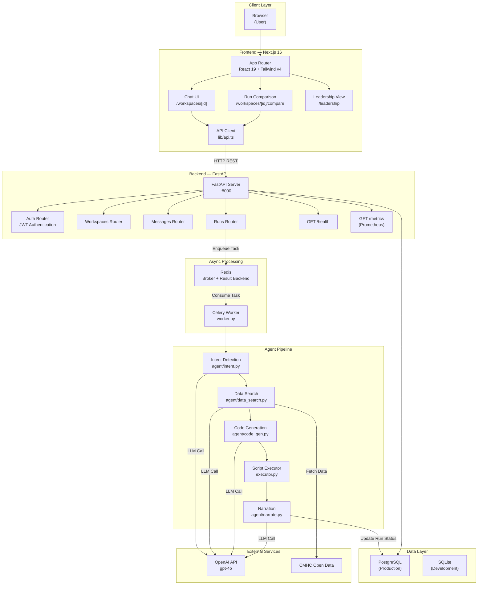

# Policy Simulator — Architecture Guide

## Overview

Policy Simulator is a conversational AI agent that helps policy makers model housing-sector policies. Users describe scenarios in natural language; the system finds relevant CMHC data, generates and runs economic/ML models (Prophet forecasting, linear regression), and returns business-friendly narrations with tables and charts.

---

## System Architecture Diagram



---

## Component Details

### 1. Frontend (Next.js 16)

| Component | Path | Responsibility |
|---|---|---|
| Chat UI | `app/(app)/workspaces/[id]/page.tsx` | Main interaction surface. Users type policy scenarios, see results. Polls active runs every 3s. |
| Run Comparison | `app/(app)/workspaces/[id]/compare/page.tsx` | Side-by-side view of multiple simulation runs for the same workspace. |
| Leadership View | `app/(app)/leadership/page.tsx` | Read-only view of approved ("selected") runs for executive review. |
| API Client | `lib/api.ts` | Typed HTTP client; all backend communication flows through here. |

**Key technologies:** React 19, Tailwind CSS v4, App Router (server/client components), `react-markdown` for rendering LLM narrations.

---

### 2. Backend API (FastAPI)

| Router | Endpoint Prefix | Responsibility |
|---|---|---|
| Auth | `/api/auth/*` | Login, JWT token issuance, user validation |
| Workspaces | `/api/workspaces/*` | CRUD for policy workspaces |
| Messages | `/api/messages/*` | Chat message history per workspace |
| Runs | `/api/runs/*` | Create simulation runs, query status/results, select runs |

**Cross-cutting:**
- `/health` — liveness/readiness probe
- `/metrics` — Prometheus metrics (request rate, latency histograms, error counts)
- CORS middleware — configurable allowed origins
- SQLAlchemy ORM with PostgreSQL (prod) or SQLite (dev)

---

### 3. Agent Pipeline

The pipeline executes sequentially within a Celery task:

```
Intent Detection → Data Search → Code Generation → Execution → Narration
```

| Stage | File | What it does |
|---|---|---|
| **Intent** | `agent/intent.py` | Classifies the user's policy scenario, extracts key parameters (region, policy type, time horizon). |
| **Data Search** | `agent/data_search.py` | Uses LLM to identify which CMHC datasets are relevant, generates download scripts, fetches data. |
| **Code Generation** | `agent/code_gen.py` | Generates a Python modelling script (Prophet, sklearn) that reads the fetched data and produces outputs. |
| **Executor** | `executor.py` | Runs the generated script in a subprocess. Collects `charts/*.png`, `tables/*.csv`, `stats.json` from `$ARTIFACTS_DIR`. |
| **Narration** | `agent/narrate.py` | Summarizes results into a business-friendly narrative using the LLM, referencing the stats and tables. |

---

### 4. Async Processing (Celery + Redis)

| Component | Role |
|---|---|
| **Redis** | Message broker (task queue) and result backend for Celery. |
| **Celery Worker** | Consumes `run_simulation` tasks. Runs the full agent pipeline. Updates the `runs` table with results on completion/failure. |

The worker uses the same codebase as the API server (same Docker image, different entrypoint). This keeps the pipeline code in one place.

---

### 5. Data Layer

| Table | Purpose |
|---|---|
| `users` | Authenticated users (email + bcrypt password hash) |
| `workspaces` | Named policy initiatives; container for messages + runs |
| `messages` | Chat history (user + assistant messages) per workspace |
| `runs` | Simulation executions: status, scenario text, narration, tables (JSON), charts (base64 JSON), parameters |

**Production:** PostgreSQL (via `psycopg2-binary`)
**Development:** SQLite (single-file, no external dependency)

---

### 6. External Services

| Service | Usage |
|---|---|
| **OpenAI (gpt-4o)** | Powers all LLM stages of the agent pipeline (intent, data search, code gen, narration). |
| **CMHC Open Data** | Source of housing market datasets. Agent-generated download scripts fetch relevant series. |

---

## Data Flow — Simulation Run

```mermaid
sequenceDiagram
    participant U as User (Browser)
    participant FE as Frontend
    participant API as Backend API
    participant R as Redis
    participant W as Celery Worker
    participant LLM as OpenAI
    participant DB as PostgreSQL

    U->>FE: "What happens if we cap rent increases at 2%?"
    FE->>API: POST /api/messages (user message)
    API->>DB: Save user message
    FE->>API: POST /api/runs (create simulation)
    API->>DB: Create run (status: pending)
    API->>R: Enqueue run_simulation task
    API-->>FE: 202 Accepted {run_id, status: pending}

    loop Every 3 seconds
        FE->>API: GET /api/runs/{id}
        API-->>FE: {status: running}
    end

    R->>W: Deliver task
    W->>DB: Set status: running
    W->>LLM: Intent detection
    LLM-->>W: {policy_type: rent_control, region: ON, ...}
    W->>LLM: Data search + download
    W->>LLM: Generate modelling script
    W->>W: Execute script (subprocess)
    W->>LLM: Narrate results
    W->>DB: Save narration, charts, tables; status: complete
    W->>DB: Save assistant message

    FE->>API: GET /api/runs/{id}
    API-->>FE: {status: complete, narration, charts, tables}
    FE->>U: Display narration + charts + tables
```

---

## Key Design Principles

1. **Separation of concerns** — Frontend is purely presentational; all business logic lives in the backend/agent pipeline.
2. **Async-first** — Simulations run asynchronously via Celery. The frontend polls for updates, keeping the UX responsive.
3. **Single image, multiple roles** — Backend API and Celery worker share the same Docker image with different entrypoints, simplifying CI/CD.
4. **LLM-driven flexibility** — The agent pipeline uses LLM at each stage rather than hard-coding policy models, allowing it to handle novel scenarios without code changes.
5. **Observable** — Prometheus metrics are built into the API server; Grafana dashboards are auto-provisioned.
