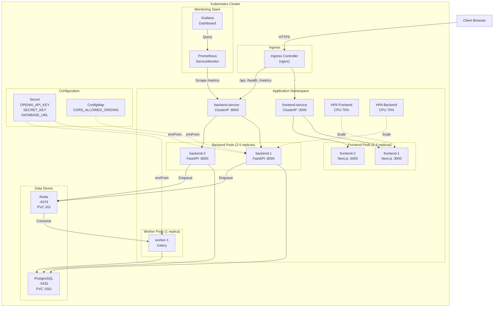
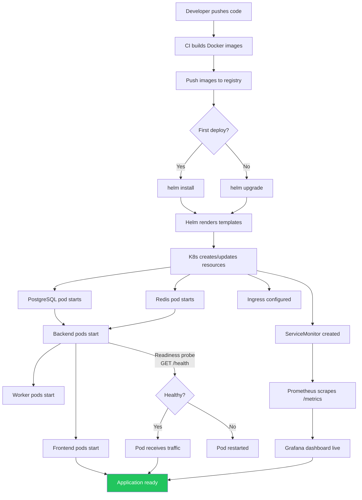
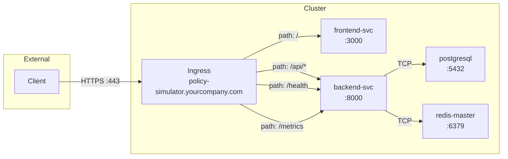

# Policy Simulator — Deployment Guide

## Overview

This guide covers deploying the Policy Simulator to Kubernetes using Helm. The deployment includes the application stack (frontend, backend, worker), data stores (PostgreSQL, Redis), and monitoring (Prometheus + Grafana).

---

## Deployment Architecture Diagram



---

## Prerequisites

| Requirement | Minimum Version | Purpose |
|---|---|---|
| Kubernetes cluster | 1.26+ | Runtime environment |
| Helm | 3.12+ | Package manager |
| kubectl | 1.26+ | Cluster access |
| Docker | 24+ | Building images |
| Container registry | — | Hosting built images (Docker Hub, ECR, GCR, ACR, etc.) |

---

## Step-by-Step Deployment

### Step 1: Build and Push Docker Images

```bash
# Set your registry prefix
export REGISTRY=your-registry.io/policy-simulator

# Build backend image
docker build -t $REGISTRY/backend:1.0.0 backend/
docker push $REGISTRY/backend:1.0.0

# Build frontend image
docker build -t $REGISTRY/frontend:1.0.0 frontend/
docker push $REGISTRY/frontend:1.0.0
```

### Step 2: Pull Helm Dependencies

```bash
cd helm
helm dependency update
```

This downloads the subchart archives (PostgreSQL, Redis, kube-prometheus-stack) into `helm/charts/`.

### Step 3: Create a Values Override File

Create `helm/values-production.yaml` with your environment-specific values:

```yaml
backend:
  image:
    repository: your-registry.io/policy-simulator/backend
    tag: "1.0.0"

frontend:
  image:
    repository: your-registry.io/policy-simulator/frontend
    tag: "1.0.0"

ingress:
  className: nginx
  hosts:
    - host: policy-simulator.yourcompany.com
      paths:
        - path: /
          pathType: Prefix
          service: frontend
        - path: /api
          pathType: Prefix
          service: backend
        - path: /health
          pathType: Exact
          service: backend
        - path: /metrics
          pathType: Exact
          service: backend
  tls:
    - secretName: policy-simulator-tls
      hosts:
        - policy-simulator.yourcompany.com

secrets:
  openaiApiKey: "sk-..."
  secretKey: "your-random-secret-here"
  seedEmail: "admin@cmhc.ca"
  seedPassword: "strong-password-here"

config:
  corsAllowedOrigins: "https://policy-simulator.yourcompany.com"

postgresql:
  auth:
    postgresPassword: "strong-db-password-here"
```

> **Security:** Never commit this file to git. Pass it at install time or use `--set` flags.

### Step 4: Install the Helm Chart

```bash
# Create namespace
kubectl create namespace policy-simulator

# Install
helm install policy-sim ./helm \
  --namespace policy-simulator \
  --values helm/values-production.yaml
```

### Step 5: Verify Deployment

```bash
# Check all pods are running
kubectl get pods -n policy-simulator

# Expected output:
# NAME                                          READY   STATUS    RESTARTS
# policy-sim-backend-xxxxx-yyy                  1/1     Running   0
# policy-sim-backend-xxxxx-zzz                  1/1     Running   0
# policy-sim-frontend-xxxxx-yyy                 1/1     Running   0
# policy-sim-frontend-xxxxx-zzz                 1/1     Running   0
# policy-sim-worker-xxxxx-yyy                   1/1     Running   0
# policy-sim-postgresql-0                       1/1     Running   0
# policy-sim-redis-master-0                     1/1     Running   0
# policy-sim-kube-prometheus-stack-...          ...     Running   0
# policy-sim-grafana-...                        1/1     Running   0

# Check health endpoint
kubectl port-forward svc/policy-sim-policy-simulator-backend 8000:8000 -n policy-simulator
curl http://localhost:8000/health
# {"status": "ok"}
```

### Step 6: Access Monitoring

```bash
# Port-forward Grafana
kubectl port-forward svc/policy-sim-grafana 3001:80 -n policy-simulator

# Open http://localhost:3001
# Login: admin / admin (or value from values.yaml)
# Navigate to Dashboards → Policy Simulator
```

---

## Deployment Flow Diagram



---

## Component Resources

| Component | Replicas | CPU Request | Memory Request | CPU Limit | Memory Limit | Storage |
|---|---|---|---|---|---|---|
| Backend | 2–5 (HPA) | 250m | 512Mi | 1 core | 1Gi | — |
| Worker | 1 | 500m | 1Gi | 2 cores | 2Gi | — |
| Frontend | 2–4 (HPA) | 100m | 256Mi | 500m | 512Mi | — |
| PostgreSQL | 1 | (subchart) | (subchart) | (subchart) | (subchart) | 10Gi PVC |
| Redis | 1 | (subchart) | (subchart) | (subchart) | (subchart) | 2Gi PVC |

---

## Networking



| Route | Target | Port |
|---|---|---|
| `/ ` | frontend-service | 3000 |
| `/api/*` | backend-service | 8000 |
| `/health` | backend-service | 8000 |
| `/metrics` | backend-service | 8000 |

---

## Common Operations

### Upgrade (new image version)

```bash
helm upgrade policy-sim ./helm \
  --namespace policy-simulator \
  --values helm/values-production.yaml \
  --set backend.image.tag="1.1.0" \
  --set frontend.image.tag="1.1.0"
```

### Scale manually

```bash
# Scale backend to 4 replicas
kubectl scale deployment policy-sim-policy-simulator-backend \
  --replicas=4 -n policy-simulator

# Scale workers for heavy load
kubectl scale deployment policy-sim-policy-simulator-worker \
  --replicas=3 -n policy-simulator
```

### View logs

```bash
# Backend API logs
kubectl logs -l app.kubernetes.io/component=backend -n policy-simulator -f

# Worker logs
kubectl logs -l app.kubernetes.io/component=worker -n policy-simulator -f
```

### Rollback

```bash
# List history
helm history policy-sim -n policy-simulator

# Rollback to previous revision
helm rollback policy-sim 1 -n policy-simulator
```

### Uninstall

```bash
helm uninstall policy-sim -n policy-simulator
kubectl delete namespace policy-simulator
```

---

## Environment Variables Reference

| Variable | Source | Used By | Description |
|---|---|---|---|
| `OPENAI_API_KEY` | Secret | Backend, Worker | OpenAI API authentication |
| `SECRET_KEY` | Secret | Backend | JWT signing key |
| `DATABASE_URL` | Secret (computed) | Backend, Worker | PostgreSQL connection string |
| `CELERY_BROKER_URL` | Secret (computed) | Backend, Worker | Redis connection for task queue |
| `CELERY_RESULT_BACKEND` | Secret (computed) | Worker | Redis connection for task results |
| `SEED_EMAIL` | Secret | Backend | Initial admin user email |
| `SEED_PASSWORD` | Secret | Backend | Initial admin user password |
| `CORS_ALLOWED_ORIGINS` | ConfigMap | Backend | Comma-separated allowed origins |
| `NEXT_PUBLIC_API_URL` | Env (in pod) | Frontend | Backend API URL for client-side calls |

---

## Monitoring & Alerting

### Metrics Collected

| Metric | Type | Description |
|---|---|---|
| `http_requests_total` | Counter | Total HTTP requests by method, path, status |
| `http_request_duration_seconds` | Histogram | Request latency distribution |
| `http_requests_in_progress` | Gauge | Currently active requests |
| `container_cpu_usage_seconds_total` | Counter | Pod CPU usage (from cAdvisor) |
| `container_memory_working_set_bytes` | Gauge | Pod memory usage |

### Grafana Dashboard Panels

The auto-provisioned "Policy Simulator" dashboard includes:
1. **API Request Rate** — requests/second over time
2. **API Response Latency (p95)** — 95th percentile response time
3. **HTTP Error Rate** — 4xx + 5xx errors/second
4. **Pod CPU Usage** — per-pod CPU consumption
5. **Pod Memory Usage** — per-pod memory consumption
6. **Simulation Throughput** — rate of new simulation runs

### Recommended Alerts (add to Prometheus rules)

```yaml
# Add to values-production.yaml under kube-prometheus-stack.additionalPrometheusRules
- alert: HighErrorRate
  expr: sum(rate(http_requests_total{status=~"5.."}[5m])) > 1
  for: 5m
  labels:
    severity: critical
  annotations:
    summary: "Backend error rate above 1 req/s for 5 minutes"

- alert: HighLatency
  expr: histogram_quantile(0.95, sum(rate(http_request_duration_seconds_bucket[5m])) by (le)) > 2
  for: 5m
  labels:
    severity: warning
  annotations:
    summary: "p95 latency exceeds 2 seconds"

- alert: WorkerDown
  expr: kube_deployment_status_replicas_available{deployment=~".*worker.*"} == 0
  for: 2m
  labels:
    severity: critical
  annotations:
    summary: "No Celery workers available"
```

---

## Troubleshooting

| Symptom | Check | Fix |
|---|---|---|
| Backend pods crash-looping | `kubectl logs` — likely missing `OPENAI_API_KEY` | Verify secrets are set correctly |
| Frontend shows "API unreachable" | `NEXT_PUBLIC_API_URL` env var | Ensure it points to backend service name |
| Simulations stay "pending" | Worker logs, Redis connectivity | Check worker pod is running and can reach Redis |
| Database connection errors | PostgreSQL pod status, `DATABASE_URL` | Verify PG is ready and password matches |
| Metrics not appearing in Grafana | ServiceMonitor, Prometheus targets | Check `kubectl get servicemonitor` and Prometheus UI targets page |
